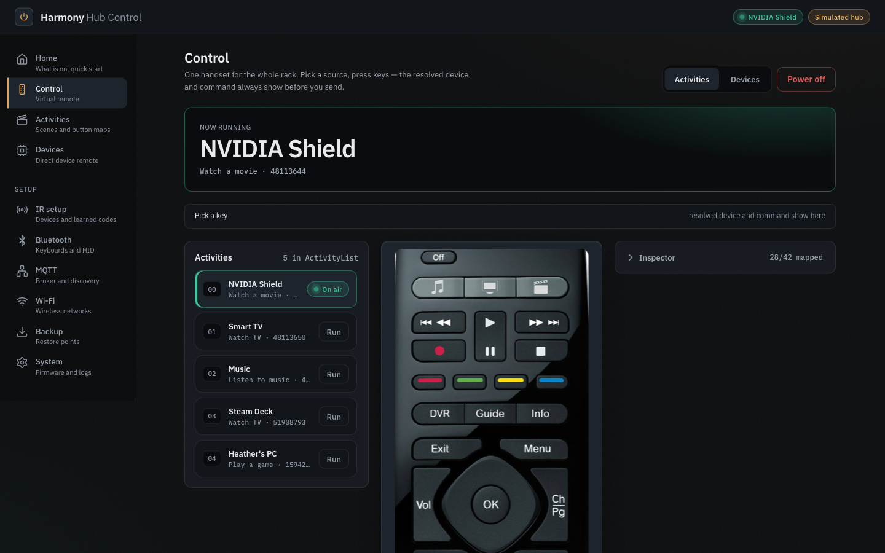
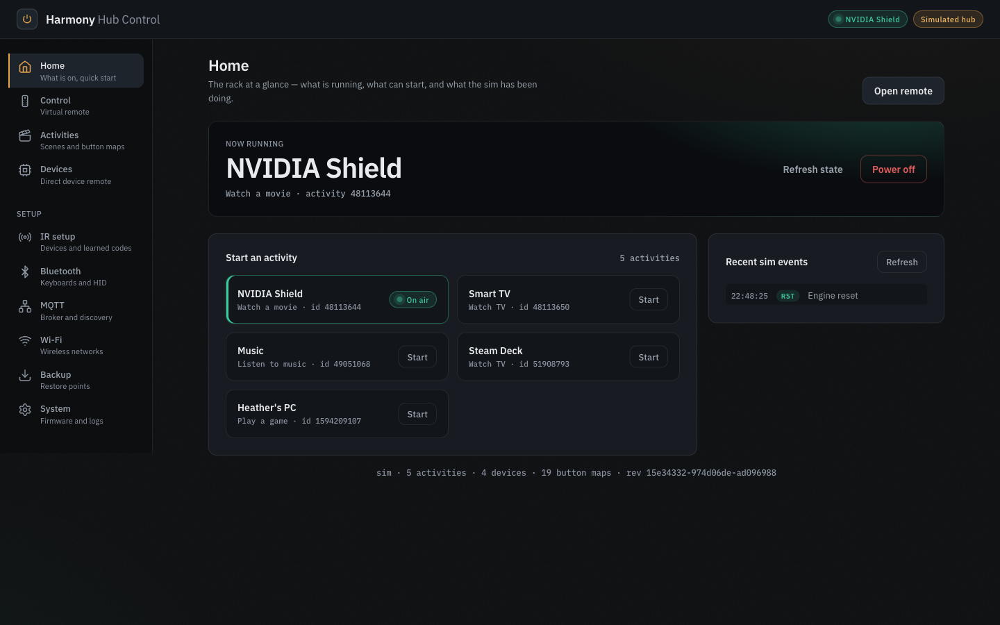
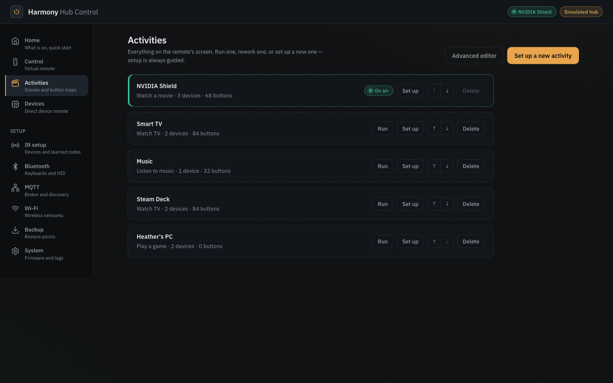
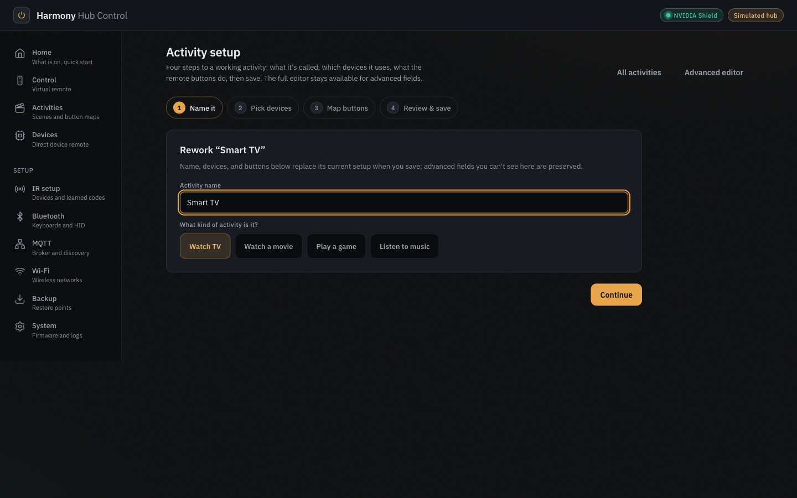
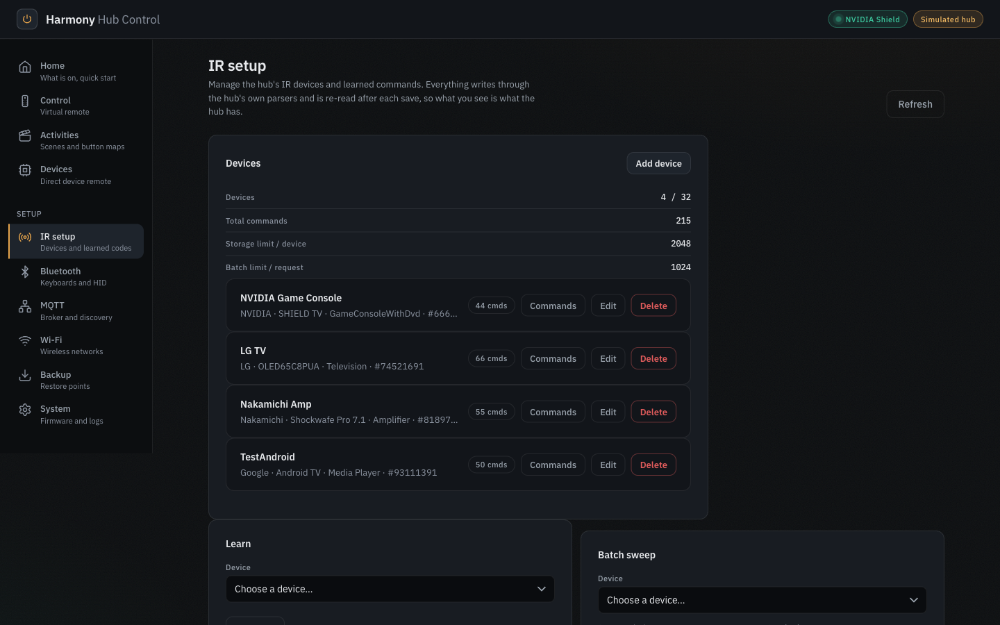
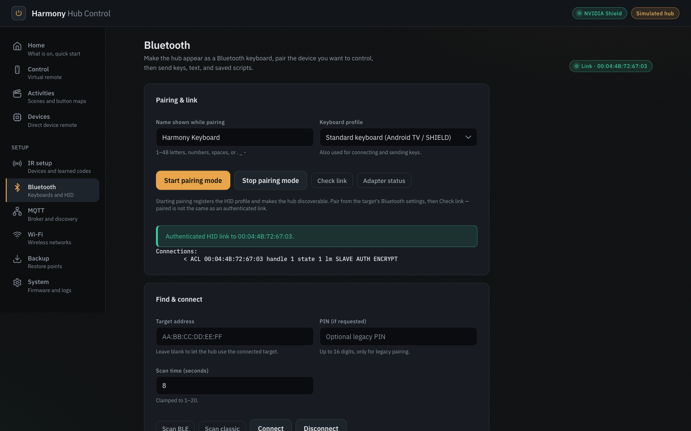
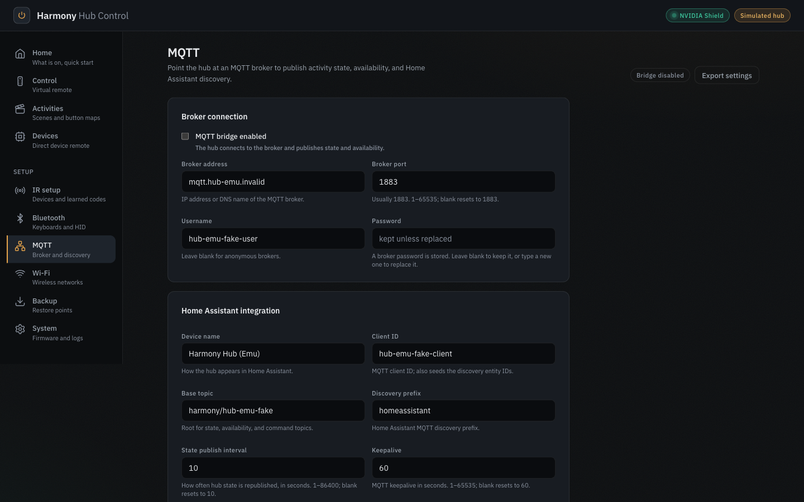
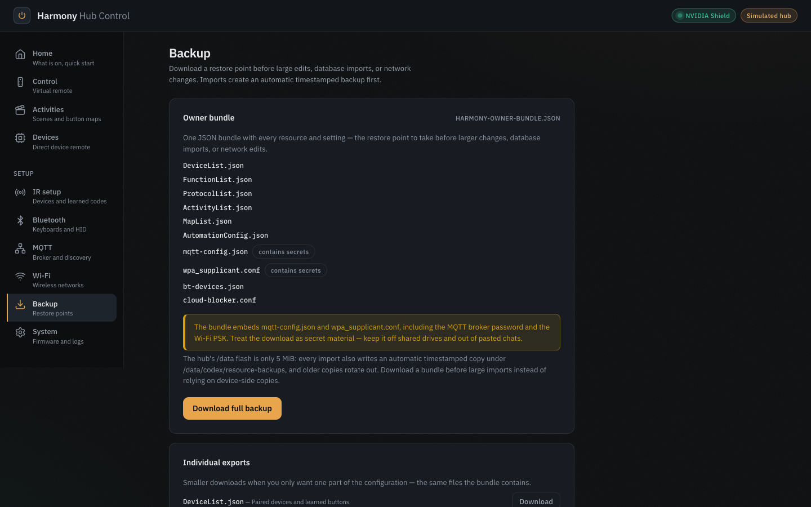
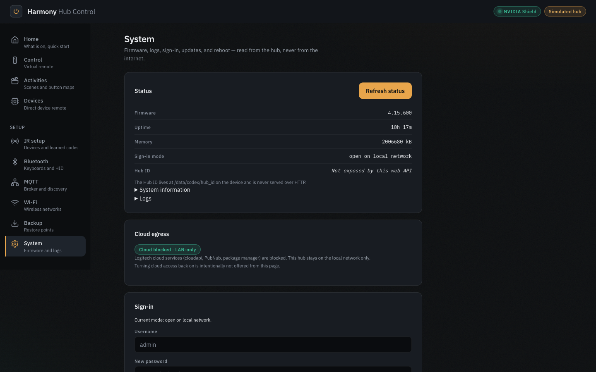

# Harmony Hub Control

**Own your Logitech Harmony Hub.** A local web remote, activity editor, and
smart-home bridge that runs on the hub itself — no Logitech app, account, or
cloud required.



Logitech ended production of the Harmony line in 2021, leaving every hub
dependent on a cloud service that can change or disappear. Harmony Hub Control
replaces that dependency for an **already-rooted** Harmony Hub: it installs a
self-contained web interface and helper runtime onto the hub over SSH, then
lets you control activities, edit configurations, learn IR codes, pair
Bluetooth devices, and integrate with Home Assistant — entirely from a browser
on your local network.

Everything lives on the hub. Your activities, device database, button maps,
and settings are plain JSON files on the hub's own flash storage, editable and
backed up from the web UI, with the Logitech cloud fully blocked by default.

> This project is for hubs that have already been rooted with
> [harmony-hub-root](https://github.com/Ripthulhu/harmony-hub-root). It
> contains no rooting tools, exploits, private keys, or personal backups.

## Why you might want this

- **Keep a discontinued product alive** — activities can be created, edited,
  and synced to the paired physical remote with no cloud allocator at all.
- **A real remote in your browser** — the actual Harmony remote skin with
  live button hotspots, on your phone or laptop, for activities *and*
  individual devices.
- **Local ownership by default** — the installer blocks Logitech cloud
  tasks, removes the hub's WAN route, and serves the paired remote's
  configuration from local storage. Normal operation does not initiate
  outbound requests; explicit owner actions that may contact external
  services include browser-side IRDB Search and Preview, hub-side
  RemoteCentral Fetch, clicked documentation links, and legacy
  owner-triggered import/update surfaces (see Browser egress policy).
- **Full IR toolbox** — learn codes from your original remotes, import from
  IRDB / Flipper-IRDB / RemoteCentral, test in batches, and experiment safely
  in a scratch "IR Lab" device.
- **More than Logitech offered** — Bluetooth HID keyboard mode with saved
  keystroke scripts, an MQTT bridge with Home Assistant discovery, Wi-Fi
  recovery tooling, and one-click backups of every resource on the hub.
- **Honest engineering** — the whole stack is open: a static C web server,
  Lua firmware plugins, and a plain JavaScript front end, plus a simulator
  and a QEMU emulator so you can try it without touching your hub.

## Feature tour

### Dashboard and browser remote

The **Home** view shows what is currently running and offers one-tap activity
start and power-off. The **Control** view renders the genuine Harmony remote
image; only keys the running activity actually maps respond, and an optional
inspector shows exactly which device and command each press resolved to. The same handset drives **Devices** mode for direct,
per-device control outside any activity.

### Activities: wizard, advanced editor, and remote sync

- A guided four-step **wizard** builds or reworks an activity: name it, pick
  device roles and inputs, map remote buttons to commands, review, save, run.
- The **advanced editor** exposes the full activity graph — roles, inputs,
  power on/off ordering, per-device power-on delays, press / long-press /
  double-press maps, and a full-fidelity JSON view — with a strict validator
  and repair pass that enforces the invariants the physical remote requires.
- The **Activities** roster runs, reorders, edits, and deletes activities;
  saves are transactional on the hub (validate → back up → write → verify →
  roll back on failure) and publish fresh configuration to the paired
  physical remote, entirely offline.

### Device and IR control

Browse every device and command on the hub, send commands directly, and
manage the IR database:

- **Learning** — capture codes from an original remote (15-second capture
  window) with automatic classification, then test before saving.
- **Importing** — search IR codes from IRDB via browser-side Search/Preview
  (fetches index and code files from public CDN resources only after you
  click Search or Preview). Flipper-IRDB, LIRC-style, and SmartIR data are
  imported from user-provided files dropped into the browser. RemoteCentral
  Pronto hex is fetched after an explicit Fetch click: the redesigned shell
  validates the path stays under `/cgi-bin/codes/`, calls
  `GET /api/remotecentral-fetch?path=...` on the hub (the route accepts GET
  or POST), and on failure warns that nothing was imported with no further
  browser egress. (The legacy form-response activity editor additionally
  falls back to a reader service at `https://r.jina.ai/` with a 9-second
  timeout and a 2-minute cooldown after HTTP 429.) Flipper `RC5`/`RC6`/`SIRC` entries are
  converted to raw timing replays when possible.
- **Batch sweeps** — stage large candidate code sets in browser memory,
  import selected commands, and fire them in cancellable batches with
  configurable delays — the practical way to find codes for an unknown device.
- **IR Lab** — a dedicated temporary test device that keeps experiments out
  of your real configuration and can be cleared in one click.

### Bluetooth pairing and HID keyboard

The hub can pair with Bluetooth targets (Android TV, NVIDIA SHIELD, PCs) using
a local pairing agent with Secure Simple Pairing and on-hub link-key storage —
no Harmony app involved. Once paired, the hub presents itself as a Bluetooth
keyboard: send text, named keys, or saved keystroke scripts from the web UI,
and mix IR and Bluetooth devices freely in one activity. Direct HID calls are
guarded so they refuse to run unless the expected target is connected and
encrypted, which prevents a known firmware crash.

### MQTT and Home Assistant

A hub-side Lua bridge publishes Home Assistant MQTT discovery, current
activity state, and device availability, and accepts activity and IR commands
over MQTT topics. Configure the broker, credentials, and topics from the web
UI or at install time; passwords are kept server-side once set.

### Wi-Fi, recovery, and system tools

- Edit the hub's Wi-Fi configuration from the browser (with an explicit,
  owner-confirmed reboot to apply).
- A recovery access point workflow can be triggered from the hub's reset
  button path if the hub ever drops off the network.
- The **System** page shows firmware/process status and logs, toggles the
  cloud blocker, triggers LAN rediscovery or reboot, manages the optional
  web sign-in, and checks for / applies payload updates from the browser.

### Backup, restore, and updates

Ten one-click exports (devices, activities, button maps, functions,
protocols, automation, MQTT, Wi-Fi, cloud, Bluetooth) plus a single
owner-bundle download covering everything. Imports are preflighted and
danger-confirmed, and the hub takes timestamped resource backups before any
destructive write. The installer itself creates a hub-side backup first, and
`restore_backup.ps1` can roll back to it.

### Offline ownership

Installed with defaults, the hub becomes a LAN-only appliance:

- Logitech cloudapi, PubNub, and package-manager tasks are prevented from
  starting.
- The WAN default route is removed and monitored; LAN and multicast routes
  are preserved, so local control, MQTT, and discovery keep working.
- Paired-remote resource reads are served from local storage, and the
  handset's normal `setup.sync` flow is answered locally so it can never
  replace your configuration with an older cloud copy.
- Activity writes are fail-closed: the hub refuses to save unless the cloud
  blocker is active, so local edits can't race a cloud sync.

### Browser egress policy

Loading the redesigned web UI and navigating between its views makes no
automatic public-Internet requests. All UI assets (HTML, CSS, JavaScript,
remote-skin image) are served from the hub itself — no external fonts, no
CDN-hosted scripts, no analytics beacons. The JavaScript may declare IRDB
endpoint URLs for Search and Preview, but those are used only after an
explicit user click.

Browser-side egress after explicit owner action:

- **IRDB Search and Preview** — after you click Search or Preview, the
  browser fetches an IRDB index and individual code files from public CDN
  resources.
- **Clicked documentation links** — GitHub and other documentation URLs
  open in the browser when you follow them.
- **Legacy import/update surfaces** — the System page's update check and
  certain import flows may contact their named sources after you trigger
  them; they do not run automatically. The legacy form-response activity
  editor also falls back to `https://r.jina.ai/http://www.remotecentral.com<path>`
  after an explicit Fetch click when the hub request fails or redirects,
  with a 9-second timeout and a 2-minute cooldown after HTTP 429.

Hub-side egress after explicit owner action:

- **RemoteCentral Fetch** — the hub fetches a RemoteCentral Pronto hex page
  only after you click Fetch in the IR import view
  (`GET /api/remotecentral-fetch?path=...`; the route accepts GET or POST).

Normal hub control, configuration, and locally available IR data work
without any Internet connection.

## Screenshots

Captured from the project's hub emulator — the real hub backend compiled for
MIPS and running under QEMU with fixture data.

| | |
|---|---|
|  *Home — now playing and one-tap starts* |  *Activities — run, rework, reorder, delete* |
|  *Activity wizard — guided four-step setup* |  *IR setup — inventory, learning, imports, sweeps* |
|  *Bluetooth — pairing and HID keyboard control* |  *MQTT — broker setup and HA discovery* |
|  *Backup — ten exports plus a full bundle* |  *System — status, cloud policy, sign-in, updates* |

## Requirements

| Requirement | Details |
|---|---|
| Harmony Hub | Already **rooted** with [harmony-hub-root](https://github.com/Ripthulhu/harmony-hub-root). This project does not root hubs. |
| SSH key | The private key produced by the root tool, named `harmony_owner_*`, in `~/.ssh` (or `%USERPROFILE%\.ssh`). |
| Hub ID | The exact numeric Hub ID printed by the root tool. **Do not guess it** — IR, capture, MQTT, and dashboard calls depend on the real value. |
| Install machine | Windows (PowerShell), or Linux/macOS (Python 3), or a Docker/Unraid host. Only plain `ssh` is used — no `scp`/`sftp` needed. |
| Network | A trusted local network. The web UI is plain HTTP with optional sign-in; never expose it to the internet. |
| Browser | Any modern browser, phone or desktop. The UI is served entirely by the hub. |

The shipped binaries target the Harmony Hub's MIPS big-endian Linux userspace.
No build step is required to install the current payload.

## Quick start

Run after the hub has been rooted. The installer finds your
`harmony_owner_*` key automatically; if you rooted with `harmony-hub-root`,
the Hub ID is read from its handoff file, otherwise pass it explicitly.

**Windows** — double-click:

```text
Install_Harmony_Control.cmd
```

or run PowerShell directly:

```powershell
.\install_webui.ps1 -HubHost <hub-ip> -HubId <numeric-id>
```

**Linux/macOS:**

```bash
python3 install_webui.py --hub-host <hub-ip> --hub-id <numeric-id>
```

Non-interactive, with MQTT disabled:

```bash
python3 install_webui.py --hub-host <hub-ip> --key-path ~/.ssh/harmony_owner_<key-name> --mqtt-disabled --no-prompt
```

The installer creates a backup on the hub, uploads the runtime, starts the
web UI, and writes MQTT config if provided. By default it enables strict
offline ownership (cloud tasks blocked, WAN route removed, local-only remote
sync) and reboots the hub once so the guarded handlers load. To stage the
cloud setting without the install-time reboot, add `-NoApplyCloudRestart`
(PowerShell) or `--no-apply-cloud-restart` (Python).

Then open:

```text
http://<hub-ip>:8080/
```

**Docker / Unraid** — a one-time installer container plus a persistent web
proxy, with a Compose example and an Unraid XML template. See
[UNRAID.md](UNRAID.md) for the full procedure and safety notes.

**Rollback** — restore the newest hub-side backup created by the installer:

```powershell
.\restore_backup.ps1 -HubHost <hub-ip> -KeyPath "$env:USERPROFILE\.ssh\<root-key-file>"
```

## How it works

There is no web framework and the hub backend has no cloud service
dependency. The entire product is a small set of purpose-built pieces that run
on the hub's ~62 MB MIPS Linux system:

```text
Your browser (LAN)
  └─ http://<hub-ip>:8080 — codex_webui: a single static C binary
       ├─ embedded single-page web app (all assets served from hub — no
       │    external fonts, no CDN scripts; JS may declare IRDB endpoint
        │    URLs used only after explicit Search/Preview clicks; hub
        │    backend may fetch RemoteCentral after explicit Fetch)
       ├─ HBus WebSocket client → the hub's Harmony activity engine
       │    (start/stop activities, IR send, IR capture)
       ├─ HAL helper + keyboard daemon → Bluetooth HID radio
       ├─ Lua plugins → firmware resource manager (transactional
       │    activity saves) and the MQTT / Home Assistant bridge
       └─ JSON resources and settings on the hub's flash (/data)
```

- **Frontend** — a dependency-free JavaScript app (hash-routed views, no
  framework) developed in `tools/webui-sim/`, then minified and embedded
  into the server binary as C headers. The virtual remote reuses the hub's
  own remote-skin image and button geometry.
- **Backend** — `payload/source/codex_webui.c`, compiled with Zig as a
  static, stripped MIPS32 binary (~0.9 MB). It serves the app and a JSON API,
  and forks per request.
- **Firmware boundaries** — activity saves go through a fail-closed Lua
  writer that validates the full activity graph against the live device list,
  backs up all three resource files, writes, verifies, and rolls back on any
  failure. Engine commands cross a loopback WebSocket (HBus); Bluetooth HID
  traffic crosses a local HAL socket with its own connection guards.
- **Persistence** — everything is plain JSON under `/data` on the hub,
  which is exactly what the backup exports download.
- **Development doubles** — `tools/webui-sim/` is a zero-dependency Node
  mock of the API for UI work, and `tools/hub-emu/` runs the *actual*
  compiled MIPS backend under QEMU in Docker, so HTTP contracts are tested
  against the real code without a hub.

## Safety and limitations

This is owner-operated software for a rooted device on a trusted network.
Read this section before installing.

- **Trusted LAN only.** The UI is plain HTTP, sign-in is optional Basic
  auth (off by default), and the server does not yet enforce cross-origin
  protections. Never port-forward or expose the hub to the internet.
- **Backups and exports contain secrets.** The Wi-Fi, MQTT, and full-bundle
  exports include your Wi-Fi password and MQTT credentials so restores are
  complete. Store downloaded backups accordingly.
- **The browser updater is a convenience, not a secure channel.** Payload
  updates fetched from the System page are not cryptographically signed.
  Apply updates deliberately, on a trusted network, with a backup in hand.
- **Some operations disrupt the household.** Wi-Fi changes, reboots, cloud
  toggles, imports, and updates can interrupt TV time or briefly take the
  hub offline. The UI confirmation-gates them; run them when you're present.
- **The hub is a small embedded device.** Data partitions are a few
  megabytes and RAM is limited. The installer and updater stage and verify
  writes, but keep backups before big imports.
- **Cloud blocking is the supported mode.** Mixing local editing with the
  Logitech app or cloud sync is not supported and can overwrite local work.

### Rules the paired physical remote enforces

The hub tolerates configurations that the physical Harmony remote does not.
The advanced editor's validator and the repair tool enforce these for you,
but they matter when importing or hand-editing JSON:

- **No action-less buttons in activity button maps.** A single button whose
  press, long-press, and double-press actions are all null makes the remote
  freeze after starting that activity until it is power-cycled.
- **Bluetooth devices driven by the remote need `IsKeyboardAssociated:
  false`** in the device list, or the remote refuses to transmit for them.
- **Activity button maps need positive, unique identities**
  (`ButtonMapId-`, `ButtonId`, `ButtonState: 1`). Offline mode never
  allocates missing identities later.
- **Slow devices need an explicit `NextDevicePowerOnDelay`** on their role
  so their input is selected only after they have powered on.

`tools/activity_graph_repair.mjs` audits and repairs all of this against a
live hub (read-only by default):

```bash
node ./tools/activity_graph_repair.mjs --base-url http://<hub-ip>:8080
```

## Development and testing

You do not need a hub to work on the UI or verify most behavior.

**UI simulator** (zero dependencies, in-memory mock API, binds loopback only):

```bash
node tools/webui-sim/server.mjs
# open http://127.0.0.1:8787/#control
```

**Hub emulator** (the real MIPS backend under QEMU, in Docker):

```bash
tools/hub-emu/run.sh               # seed → build → container
node tools/hub-emu/dev-proxy.mjs   # UI + API proxy on :8787
```

**Test suites** (all runnable on a host machine):

```bash
node --test tools/webui-sim/test/*.test.mjs   # UI/model unit tests
node tools/activity_ui_model_smoke.mjs        # activity editor model
sh tools/activity_json_semantic_smoke.sh      # save-path JSON semantics
sh tools/activity_offline_guard.sh            # offline guard packaging
sh tools/bluetooth_hid_smoke.sh               # Bluetooth HID guards
node tools/ir_database_smoke_test.mjs --sample=24 --per-device=10 --source=all --dry-run
python3 docker/tests/test_manager.py          # Docker manager
node tools/hub-emu/qa.mjs                     # contract QA vs real backend
```

**Rebuilding the web UI binary** (only when native source or embedded assets
change):

```bash
sh tools/package_harmony_shell.sh   # bundle the shell UI into a C header
sh tools/embed_activity_ui.sh       # embed the advanced editor assets
zig cc -target mips-linux-musleabi -Os -static -s -I payload/source -o payload/bin/codex_webui payload/source/codex_webui.c
```

The result must be `ELF 32-bit MSB executable, MIPS, MIPS32 rel2, statically
linked, stripped`. Update `payload/bin/MANIFEST.txt` after replacing
binaries, deploy to a test hub, and verify the dashboard, IR import,
Bluetooth HID, MQTT, and rollback paths. See [docs/BUILD.md](docs/BUILD.md)
for the full Linux toolchain path.

## Documentation

| Document | Contents |
|---|---|
| [UNRAID.md](UNRAID.md) | Docker / Unraid deployment procedure and safety notes |
| [docs/API.md](docs/API.md) | HTTP API for scripts and integrations |
| [docs/BUILD.md](docs/BUILD.md) | Rebuilding the MIPS binaries |
| [docs/SECURITY.md](docs/SECURITY.md) | Security policy and pre-sharing checklist |
| [docs/FULL_FEATURE_ANALYSIS.md](docs/FULL_FEATURE_ANALYSIS.md) | In-depth, evidence-graded feature and architecture analysis |
| [DESIGN.md](DESIGN.md) | Web UI design system |
| [tools/webui-sim/README.md](tools/webui-sim/README.md) | UI simulator and production shell packaging |
| [tools/hub-emu/README.md](tools/hub-emu/README.md) | QEMU hub emulator |
| [CONTRIBUTING.md](CONTRIBUTING.md) | Contribution guidelines |

## Contributing, security, and credits

Contributions are welcome — keep changes scoped, prefer small pull requests
with a short test note, and never commit SSH keys, MQTT passwords, tokens,
hub backups, firmware dumps, or rooting tools. See
[CONTRIBUTING.md](CONTRIBUTING.md) and [docs/SECURITY.md](docs/SECURITY.md)
before sharing changes.

- Hub rooting: [harmony-hub-root](https://github.com/Ripthulhu/harmony-hub-root)
- Upstream project: [Ripthulhu/harmony-hub-control](https://github.com/Ripthulhu/harmony-hub-control)

**License:** this repository does not currently include a license file, so
default copyright applies. Confirm redistribution rights with the author
before republishing binaries or images built from it.
